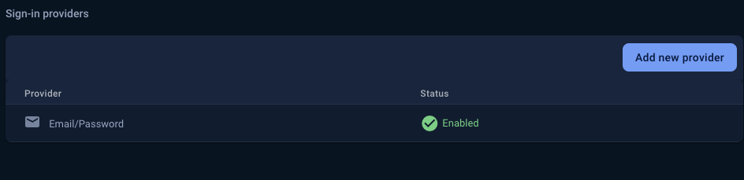

# PSI Suite - Aplicación Android
Aplicación Android que levanata un nodo y expone una interfaz sencilla de usar con el objetivo de probar diferentes criptosistemas y protocolos para calcular PSI (Private Set Intersection) o conjuntos de intersecciones privados.
Compatible con los nodos levantados por un servicio web [WS_PSI-PSI Suite](https://github.com/4rius/WS_PSI).

## Requisitos
- API 26 (Android 8.0) o superior. Recomendado: API 34 (Android 14).
- Android Studio Iguana o Jellyfish.

No quiere decir que no funcione en otras versiones de Android Studio, pero no se ha probado y puede haber problemas con los plugins de Gradle.

## Instalación
Se proponen dos vías de instalación:

<details><summary>Vía APK (Fácil y rápido) </summary>

Se pueden encontrar dos versiones de la aplicación en la página de [releases](https://github.com/4rius/APP_PSI/releases/) del repositorio:

- `PSI-Suite_RTDB_X.X.apk`: Versión que envía (o puede) enviar registros a la base de datos de este proyecto.
- `PSI-Suite_NoRTDB_X.X.apk`: Versión que no envía registros a ninguna base de datos (sigue mandando información a Crashlytics).


Se plantean como formas sencillas de probar el proyecto, pero se recomienda compilar el proyecto desde Android Studio para depurar, ver logs y conectar un proyecto de Firebase propio.

1. Descargar el archivo APK.
2. Instalar el archivo APK en el dispositivo Android.

Se puede instalar en emuladores.
</details>

<details><summary>Vía Android Studio (Mejor para continuar el desarrollo del proyecto) </summary>

1. Clonar el repositorio en Android Studio. (`https://github.com/4rius/APP_PSI.git`)
2. Al abrir el proyecto se debería compilar automáticamente. Si no es así, se pueden seguir estos pasos:
   1. Sincronizar el proyecto con Gradle. (`File -> Sync Project with Gradle Files`)\
   
   2. Compilar el proyecto. (`Build -> Make Project`). Si hubiera algún error, se puede revisar el log o volver a compilar utilizando la opción `Build -> Rebuild Project`.\
   
3. Ahora es necesario tener un dispositivo Android conectado al ordenador o arrancar un emulador previamente configurado.\
    \


</details>

En ambas opciones, cuando la aplicación se inicie, creará un nodo descentralizado que puede empezar a operar en la red local. Para que otros dispositivos se conecten a este nodo, deben estar en la misma red local y conocer la dirección IP del dispositivo que aloja el nodo.

También se generan las claves de los criptosistemas y el conjunto de datos oculto que se utilizará en las operaciones de PSI.

## Modificación de parámetros

La interfaz de Android permite realizar las mismas operaciones que los servicios web, desde la hoja inferrior de la aplicación se pueden realizar todas las operaciones de gestión de la app y el nodo, así como recuperación de datos y conexión a otros compañeros, y desde las opciones de los dispositivos se pueden realizar las mismas operaciones de comunicación.

De nuevo, no es posible *modificar* la IP que se le asigna al nodo (que es la IP local), pero **se puede realizar el cambio** si se quisiera que el nodo se expusiera a internet. Esto no ha sido probado en el alcance de este proyecto, pero con una IP pública y un puerto abierto, no debería haber problemas.

## Configuración de Firebase

La aplicación utiliza Firebase para el sistema de registro y autenticación de usuarios. Se ha configurado un proyecto de Firebase para este propósito, pero se puede cambiar por otro proyecto propio.

Para cambiar el proyecto de Firebase, se deben seguir los siguientes pasos:

1. Crear un proyecto de Firebase en la [consola de Firebase](https://console.firebase.google.com/).
2. Añadir la aplicación Android a este proyecto.
3. Descargar el archivo `google-services.json` que se proporciona al configurar el proyecto, o que se puede encontrar en los ajustes generales del proyecto. \

4. Reemplazar el archivo que se encuentra en la carpeta `app` del proyecto de Android \

5. La aplicación ya está configurada, se deja a continuación una guía para añadir el usuario que permitirá la autenticación en la aplicación y el envío de registros a la base de datos. De lo contrario, la aplicación funcionará pero no podrá enviar registros \
 \
En la aplicación se puede comprobar que no se ha autenticado correctamente. Una compilación así nunca tendrá la capcidad de enviar registros a la base de datos. \


## Configuración de la Realtime Database de Firebase

1. Configurar la Realtime Database de Firebase para que se puedan almacenar los datos de los usuarios. Consiste en inicializarla y configurar las reglas de acceso. Tal y como están en este proyecto, permiten lectura y escritura en el nodo `logs` a cualquier usuario autenticado.
    ```
    {
      "rules": {
        "logs": {
          ".read": "auth != null",
          ".write": "auth != null"
        }
      }
    }
    ```
2. En la consola de Firebase, ir a la sección de `Authentication`. \

3. Añadir el método de autenticación por correo electrónico y contraseña. \

4. Crear un usuario en la sección de `Users`. \
 \

   - Se recomienda deshabilitar el registro de más usuarios por motivos de seguridad. \
   
5. Crear un archivo `FirebaseCredentialsAndroid.properties` con el siguiente contenido:
    ```
    FIREBASE_EMAIL=correo@correo.com
    FIREBASE_PASSWORD=contraseña
    ```
    Con los datos del usuario creado.
6. Crear una carpeta de recursos en la carpeta `app` del proyecto de Android y colocar el archivo creado. \

7. Añadir el archivo al `.gitignore` para que no se suba al repositorio.
8. Compilar el proyecto y ejecutarlo. La autenticación se realizará en el servicio de registros de manera transparente para el usuario. \
 \
Desde la aplicación también se puede comprobar que se ha autenticado correctamente. El usuario puede desactivar esta opción en cada sesión de uso. \


## Licencia
Este proyecto está distribuido bajo la licencia MIT. Para más información, consultar el archivo [LICENSE](LICENSE).
